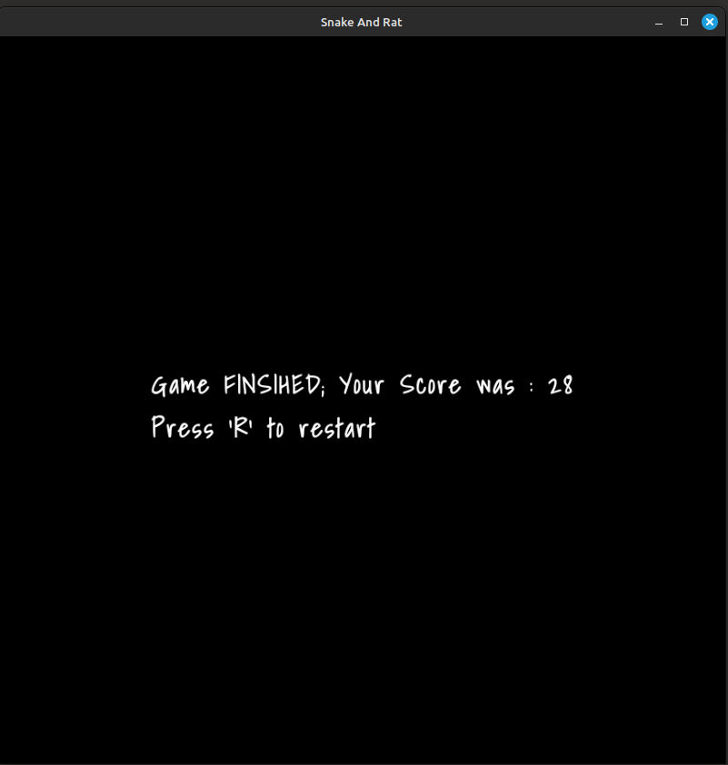

# Snake And Rat game

-   [Game Overview](#Game-Overview)
-   [How to Execute?](#How-to-Execute)
-   [Alternate Compilation](#Alternate-Compilation)
-   [Installing Clang](#install-clang)
-   [See UI of Game](#game-ui)

## Game Overview

-   Language Used : **C++**
-   Libraries Used : **libsfml**
-   OS : Linux (Ubuntu/Debian Based)

## How to Execute?

1. Generate the Executable
   

2. Install Dependencies
   

3. Delete the Executable
   

## Alternate Compilation

There is also a `compile-game.sh` file present, which can also be used to generate executable.

## Install Clang++

## Game UI

<!--  -->

This is the in-game UI.

<!--  -->

This is the game over UI.

